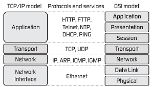

# Fastcampus Sprint - Programming

## Day 3. Network

---
<!--
paginate: true
theme: default
size: 16:9
footer : fastcampus 디지털 마케팅 스쿨, Wooyoung Choi, 2019
-->

## Do it your self!

### Numguess

- 1부터 100까지 정수 중 하나를 `answer`라는 변수에 할당
- 사용자로 부터 임의의 값 하나를 받아 `guess`라는 변수에 할당
- `answer`와 `guess`를 비교하여 정답여부를 출력

---

## numguess

```python
import random


answer = random.randint(1,100)
print(answer)
```

---

## numguess

```python
username = input("Hi there, What's your name?? ")
guess = eval(input("Hi, "+ username + "guess the number: "))

if guess == answer:
	print("Correct! The answer was ", str(answer))
else:
	print("That's not what I wanted!! The answer was ", str(answer))
```

---

## Iteration

---

## For, while

```python
for 변수 in (리스트 or 문자열):
	실행문1
    ...
```

```python
for i in ["python", "java", "golang"]:
	print(i)
```

---

## For, while

```python
sum = 0
for i in range(1,11):
	sum += i
    sum = sum + i
	print(sum)
```

---

## For, while

```python
while 조건:
	실행문1
	...
```

```python
while name != "foo bar":
	name = input("What's your name? ")
	print("Hi, " + name + "So, where is foo bar?")
```

```python
while 1:
	print("Hello world!")
```

---

## Iterations with Conditional Statements

---

## Fizzbuzz

1부터 100까지 **반복하면서,**

3의 배수 = "Fizz"
5의 배수 = "Buzz"
15의 배수 = "FizzBuzz"
나머지 = 그 숫자

---

## Fizzbuzz

```python
num = eval(input("type the number: "))

for i in range(1, num + 1):
	if i % 15 == 0:
		print("fizzbuzz")
	elif i % 3 == 0:
		print("fizz")
	elif i % 5 == 0:
		print("buzz")
	else:
		print(i)
```

---

## Refactoring numguess

```python
import random


answer = random.randint(1,100)
username = input("Hi there, What's your name?? ")

while True:
	guess = eval(input("Hi "+ username + ", guess the number: "))

	if guess == answer:
		print("Correct! The answer was ", str(answer))
		break
	else:
		print("That's not what I wanted!! Try again!!")
```

---

## give a hint!!

```python
import random


answer = random.randint(1,100)
username = input("Hi there, What's your name?? ")

while True:
    guess = eval(input("Hi, "+ username + "guess the number: "))

    if guess == answer:
        print("Correct! The answer was ", str(answer))
        break
    elif guess > answer:
        print("Too high!! Try again!!")
    elif guess < answer:
        print("Too Low!! Try again!!")
```

---

## limit trial

```python
import random


answer = random.randint(1,100)
username = input("Hi there, What's your name?? ")
trial = 5
while trial:
    guess = eval(input("Hi, "+ username + ". guess the number: "))

    if guess == answer:
        print("Correct! The answer was ", str(answer))
        break
    elif guess > answer:
        trial -= 1
        print("Too high!! Try again!!(%d times left)" % (trial))
    elif guess < answer:
        trial -= 1
        print("Too Low!! Try again!!(%d times left)" % (trial))
    if trial == 0:
        print("You are Wrong! The answer was ", str(answer))
```

## Index

- 네트워크란?
- Web이란?
- 웹 스크래핑을 이해하기 위한 HTML/CSS

---

### Network

A computer network or data network is a telecommunications network which allows nodes to share resources.

--> 컴퓨터간 리소스를 공유 가능하게 만드는 통신망

---

## Ethernet

- 전세계의 사무실이나 가정에서 일반적으로 사용되는 유선 LAN에서 가장 많이 활용되는 기술 규격
- ether == 에테르 == 빛의 매질
- IEEE 802.3 규약 기반
- OSI 7 Layer에서 Data-link Layer 에 위치

---

## OSI 7 layer



---

### Internet

TCP/IP를 활용하여 정보를 주고 받는 통신 네트워크(www)

---

### WWW(World Wide Web) == hypertext transfer through TCP/IP 

---

### Request & Response


---

### Web Architecture


---

### 웹 개발 패턴의 변화

```html
<html>
<head></head>
<body>
<h1>Static Header</h1>
<div>Static Contents</div>
</body>
</html>
```

- 1991 ~ 1999: Sir Timothy John "Tim" Berners-Lee가 하이퍼텍스트 기반의 프로젝트를 제안한 이후 정적인 컨텐츠들을 중심으로 한 웹 기술이 발달

---

### 웹 개발 패턴의 변화

```html
<html>
<head></head>
<body>
<h1></h1>
<div></div>
</body>
</html>
```

- 1999 ~ 2009: Linux, Apache, Mysql, Php 중심의 동적인 서버, 정적인 클라이언트 모델이 지속됨

---

### 웹 개발 패턴의 변화

```html
<html>
<head>
<script src="https://unpkg.com/vue"></script>
</head>
<body>
<h1>{{ header }}</h1>
<div id="app">
  {{ message }}
</div>
<script>
var app = new Vue({
  el: '#app',
  data: {
    message: '안녕하세요 Vue!'
  }
})
</script>
</body>
</html>
```

- 2010 ~ 현재: javaScript!! (Dynamic Web Client)

---

### HTML

- HyperText Markup Language

---

#### HTML

```html
<!doctype html>
```

---

#### HTML

```html
<!doctype html>
<html>
 <head></head>
 <body></body>
</html>
```

---

#### HTML

```html
<head>
 <meta charset="utf-8">
 <meta name="viewport" 
 content="width=device-width, initial-scale=1.0">
 <title></title>
</head>
```

---

#### HTML

```html
<body>
 <div id="main-wrapper">
 <h1 class="article-title"></h1>
 <p>This is <span>Home</span>.</p>
 <a href="#" target="_blank">hypertext</a>
 
 </div>
</body>
```

---

#### HTML - Semantic Element

```html
<header>
 <nav></nav>
</header>

<section>
 <article></article>
</section>

<aside></aside>
<footer></footer>
```

---

### CSS

- Cascading Style Sheet
- 웹 문서의 스타일링을 위한 스타일시트

---

#### CSS basic style

```css
body {
	background-color: gray;
}
```

---

#### CSS Selector

---

#### id, class, just tags

```css
#some-id {color:#ff0000;}

.some-class {color:#00ff00;}

body {background-color:#dddddd;}
```

---

#### group selector

```css
h1, h2, h3, h4, h5, h6 {font-family:Helvetica;}
```

#### child selector

```css
body > h1 {align:center;}
```

#### attribute selector

```css
p[title='introduce'] {font-family:Helvetica;}
```

---

### javaScript

- 객체 기반의 스크립트 프로그래밍 언어
- 웹페이지의 동적인 제어 목적
- Netscape의 Brendan Eich가 모카(Mocha)를 개발
- LiveScript -> javaScript로 개명

---

#### JS DOM API

- DOM: Document Object Model
- HTML 문서를 분석하여 구조화

---

## DOM

- Document Object Model

```html
<!doctype html>
<html>
 <head>
  <meta charset="utf-8">
  <title>My page</title>
 </head>
 <body>
  <h1>Home</h1>
  <p>Hello there!</p>
 </body>
</html>
```

---

## DOM


---

### Static Web site - 1

<div id="dynamic-btn1" style="width:200px; height:200px; background:red;"></div>

---

### Static Web site - 2

<div id="dynamic-btn2" style="width:200px; height:200px; background:green;"></div>

---

### Static Web site - 3

<div id="dynamic-btn3" style="width:200px; height:200px; background:blue;"></div>

---

### Dynamic Web site

<div id="dynamic-btn" style="width:200px; height:200px; background:black;"></div>
<button type="button" onclick="document.getElementById('dynamic-btn').style.background='red'" style="font-size:20px;">Red</button>
<button type="button" onclick="document.getElementById('dynamic-btn').style.background='green'" style="font-size:20px;">Green</button>
<button type="button" onclick="document.getElementById('dynamic-btn').style.background='blue'" style="font-size:20px;">Blue</button>

---

### Java != javaScript

|Java|vs|javaScript|
|:--:|:--:|:--:|
|Sun|개발|Brendan Eich|
|JVM|구동방식|Script Engine(Browser)|
|C|영향|C|
|붕어|Like|붕어빵|

---

### XPath

- XML Path Language
- XML 문서의 요소와 속성을 통해 특정한 요소로 접근할 수 있도록 도와줌

---

#### Basic XPath

```html
<body>
 <div id="site-wrapper">
  <h1 class="main-title">Page Title</h1>
  <div>
   <p class="paragraph">
    I am 
    <span>a</span> 
    boy.
   </p>
   <a href="#">Hypertext</a>
  </div>
 </div>
</body>
```

---

#### Basic XPath

`h1` : nodename
`/html` : root node
`//div` : select from current node
`.` : current node
`..` : parent node
`@` : attribute

---

#### Basic XPath

`//body/div/p`
`//*[@id="site-wrapper"]/div/a`
`//*[@class="paragraph"]/text()`

<link href="https://fonts.googleapis.com/css?family=Nanum+Gothic:400,800" rel="stylesheet">
<link rel='stylesheet' href='//cdn.jsdelivr.net/npm/hack-font@3.3.0/build/web/hack-subset.css'>

<style>
h1,h2,h3,h4,h5,h6,
p,li, dd, table > * > * {
font-family: 'Nanum Gothic', Gothic;
}
span, pre {
font-family: Hack, monospace;
}
</style>